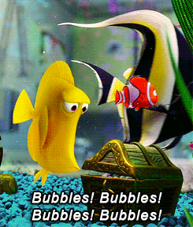

+++
title = "Boiling Learning"
description = "Deep learning models for phase-change quantification and classification (Master's thesis)"
weight = 2

[taxonomies]
tags = ["Python", "AI", "Open Source", "Machine Learning", "Computer Vision", "Deep Learning", "Tensorflow", "Mechanical Engineering", "Master's"]

[extra]
local_image = "projects/boiling-learning/boiling-learning.gif"
+++

Deep learning models for phase-change quantification and classification.

<!-- TODO: add nice icons for the links -->

[GitHub](https://github.com/ruancomelli/boiling-learning) • [Paper](https://doi.org/10.1016/j.applthermaleng.2024.124040) • [Thesis](https://repositorio.ufsc.br/bitstream/handle/123456789/249851/PEMC2305-D.pdf?sequence=1&isAllowed=y) • [Thesis Repository](https://github.com/ruancomelli/masters-thesis) • [Thesis Slides](https://docs.google.com/presentation/d/16p-iAApRbUhYKsxXFcBTb9mXG0LGdIXkJ7l2VzyCzp4/edit?usp=sharing)

<!-- TODO: make this GIF smaller -->
<!-- TODO: add GIF source -->

<!-- TODO: write this up -->

<h1 style="text-align: center">
🚧 Under Construction 🚧
</h1>
